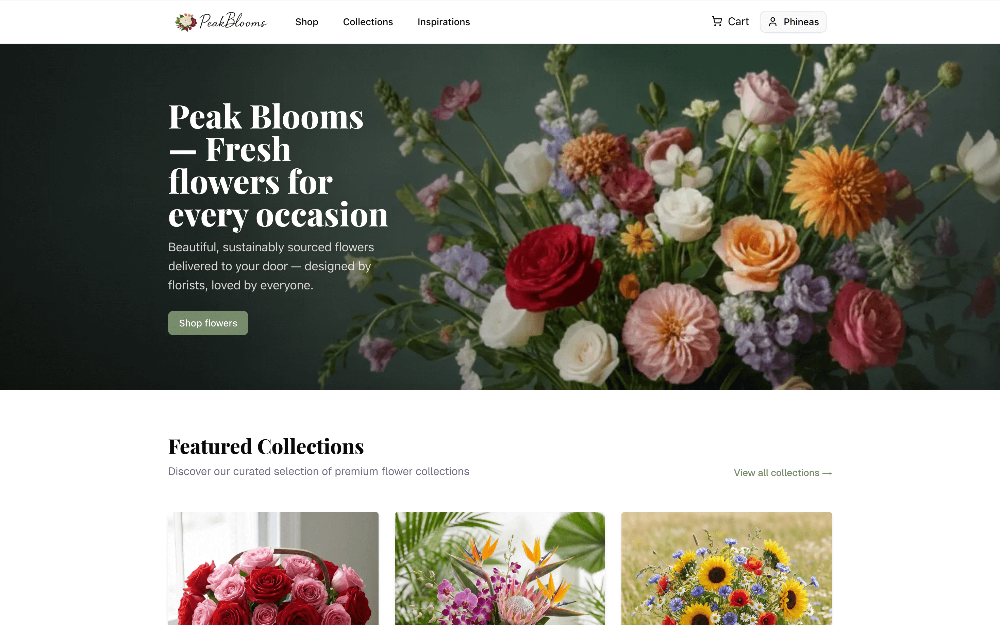

# Peak Blooms

Peak Blooms is a modern wholesale flower shop application built with Next.js. It serves as a B2B e-commerce platform with a focus on clean design and inspirational content for florists.



## Documentation

- [Functional Requirements](docs/functional_requirements.md): Details on user roles, features, and application logic.
- [Style Guide](docs/style_guide.md): Information on the color palette, UI components, and design principles.

## Project Overview

This application is designed to be:

- **Professional & Modern:** A clean aesthetic distinguishing it from competitors.
- **Efficient:** Streamlined B2B purchasing workflow.
- **Inspirational:** Content to engage smaller florist businesses.

### Key Features

- **Dual User Roles:** Customer (requires approval) and Admin — separate experiences and workflows.
- **Conditional Visibility:** Prices and cart are hidden for guests; only approved customers can purchase.
- **Full Text Search & Filters:** Fast product discovery via free-text search, categories, and helpful filters.
- **Curated Collections & Inspiration:** Editorial-led collections and inspiration pages to help retailers discover new assortments.
- **Quick Reorder & Bulk Orders:** Repeatable orders and streamlined cart workflows for wholesale customers.
- **Analytics & Leads:** Built-in admin analytics and lead collection to understand customer behavior and outreach.

### Design & Functionality

- Clean, intentional visual language focused on product imagery and curation.
- Mobile-first responsive layouts with a B2B-first UX (quick adds, bulk selection, and reorder flows).
- Accessibility-minded components and consistent design tokens (see `src/components/ui/`).
- Developer-first setup — local seed data, clear conventions, and standard Next.js tooling.

### Planned / Optional Improvements

- Integrate a real email provider for transactional emails (SMTP / Sendgrid / Mailgun).
- Add payment processing and delivery options to support live orders.
- Add unit and end-to-end tests for stability, and CI checks to prevent regressions.
- Improve perceived performance with client-side loading states and skeletons for a snappier feel.
- Add marketing/analytics hooks, coupon codes, and a newsletter signup flow to support growth.

## Getting Started

First, run the development server:

```bash
npm run dev
# or
yarn dev
# or
pnpm dev
# or
bun dev
```

Open [http://localhost:3000](http://localhost:3000) with your browser to see the result.

### Seeded development accounts

For local development the seed script creates a few test users you can use in the admin and app:

- Admin: `phineas.kibbey@gmail.com` (role: ADMIN)
- Pending user: `pending@peakblooms.com` (role: CUSTOMER, not approved)
- Customer: `customer@peakblooms.com` (role: CUSTOMER, approved)
- Newsletter subscriber: `newsletter@peakblooms.com` (role: SUBSCRIBER)

## Tech Stack

- **Framework:** [Next.js](https://nextjs.org)
- **Styling:** Tailwind CSS
- **Font:** [Geist](https://vercel.com/font)

## Conventions

UI primitives are located in `src/components/ui/`. For consistent visual tokens, accessible keyboard/focus behavior, and predictable styling, use the shared `Button` component for all interactive controls and CTAs. To style a Next.js `Link` like a button, use the `Button` component's `render` prop and pass the `Link` element to it so routing semantics are preserved.
